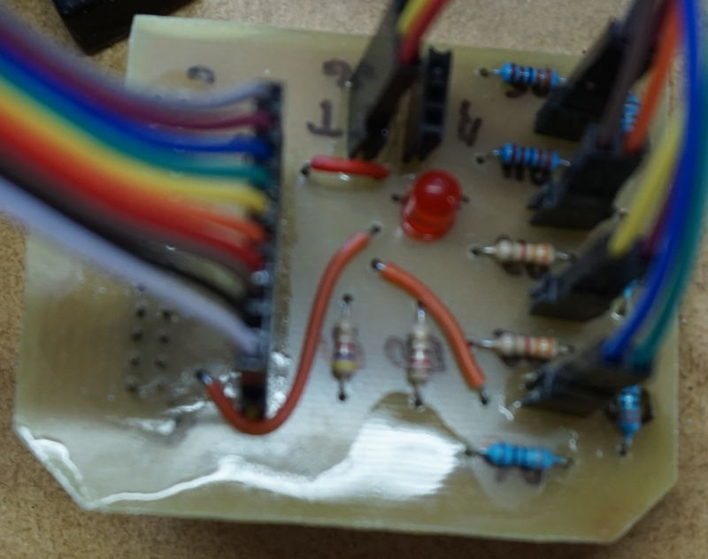
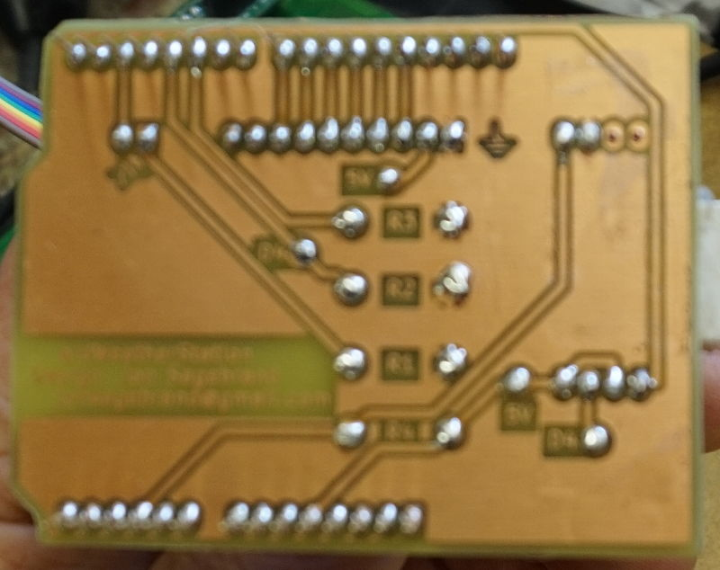
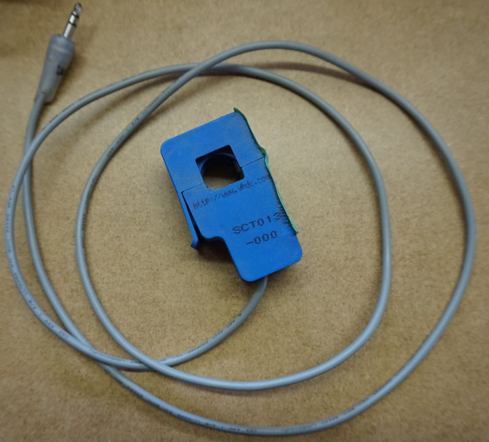
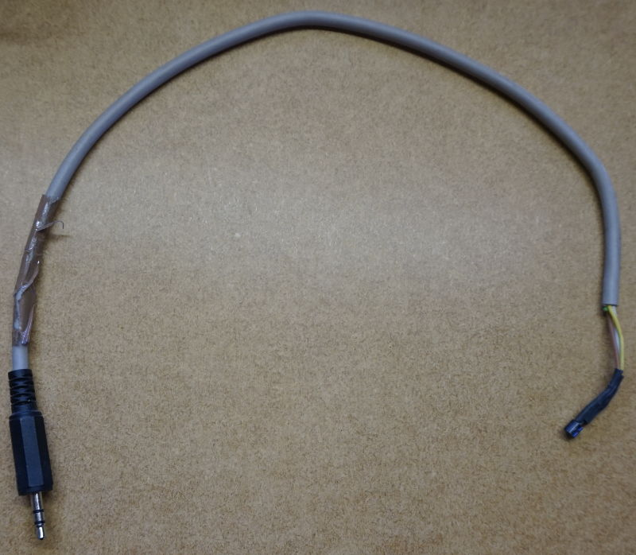
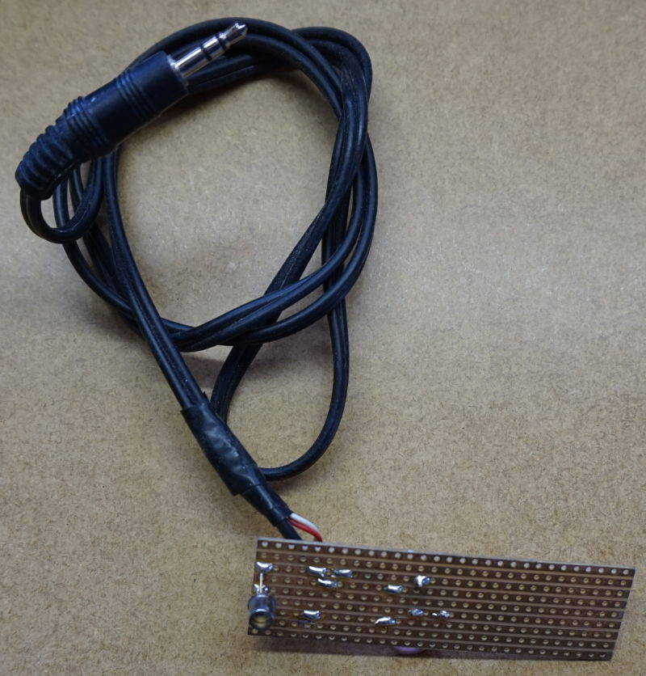
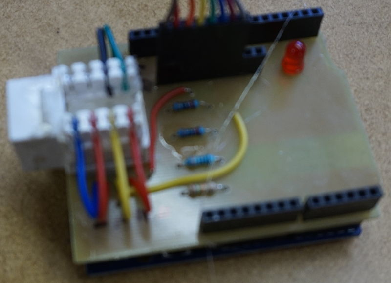
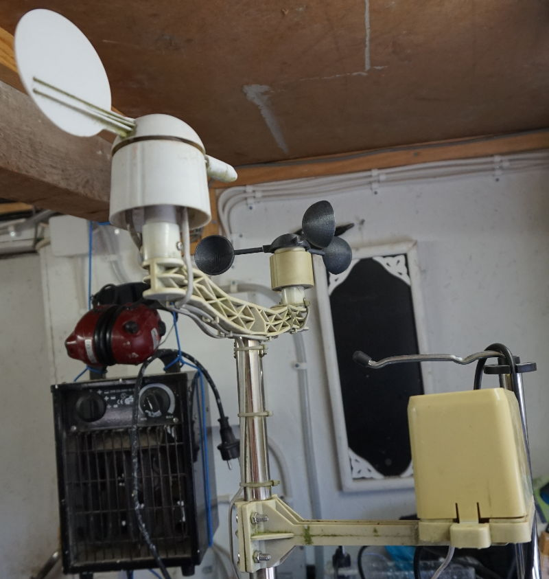

# pi-heating

Some scripts tweaked from https://github.com/JeffreyPowell, and many others created by me.  

Also there are CAD drawings and PCB layouts to build the electrical parts.  

Eventually you will have a Raspberry Pi that:

* controls (for example) a heater
* measures and logs your electric power consumption
* measures and logs numerous temperatures
* measures and logs wind direction and speed
* measures and logs rain
* presents it all via web GUI with some nice graphs
* also presents it on LCD displays
* can export logs to (spreadsheet or) csv

Let's start it all by

## Installing OS

Download 'Raspberry Pi OS Lite' from [https://www.raspberrypi.com/software/operating-systems/](https://www.raspberrypi.com/software/operating-systems/)  

Cd to where your download is and unpack it  
>$ unzip *-raspios-buster-armhf-lite.zip  

Insert SD-card and find out drive letter  
>$ dmesg  

For example /dev/mmcblk0 or /dev/sdb  

Unmount if mounted  
>$ umount /dev/mmcblk0p1  

Write image to SD-card  
>$ sudo dd bs=4M if=<version\>-raspios-buster-armhf-lite.img of=/dev/<device\> conv=fsync status=progress  

    1870659584 bytes (1,9 GB, 1,7 GiB) copied, 105 s, 17,8 MB/s  
    447+0 records in  
    447+0 records out  
    1874853888 bytes (1,9 GB, 1,7 GiB) copied, 139,716 s, 13,4 MB/s  

Remove SD-card and insert it again to make new partitions visible  

Mount the first partition  
>$ sudo mount /dev/<device\>1 /mnt/tmp  

Write empty file to boot partition to enable ssh at boot  
>$ sudo touch /mnt/tmp/ssh  

Remove SD-card and insert it in a RPi connected to your local network and boot it up  

## RPi configuration

### How to find RPi's IP

If you can't locate the IP, here's a little tutorial  

First find your subnet  
>$ ip -o -f inet addr show | awk '/scope global/ {print $4}'  

You will get something like  

    192.168.10.39/24  

where the first of is your ip, and the second is the netmask  

Now scan your local network for hosts  
>$ nmap -snP 192.168.10.0/24  

where the first is your subnet, and the last is the netmask  
Try to figure out which is your RPi from the output  

### How to connect without ssh password (optional)

If you haven't already, create a keypair  
>$ ssh-keygen ~/.ssh/id_rsa  

Copy the public key to RPi  
>$ ssh-copy-id -i ~/.ssh/id_rsa.pub pi@<IP\>  

### Connect and configure

>$ ssh <IP\> -l pi  

Login with user: pi and password:raspberry  

Update  
>$ sudo apt-get update && sudo apt-get upgrade && sudo apt autoremove  

Configure  
>$ sudo raspi-config  

* 1    Change password  
* 2 N1 Change hostname  
* 4 T1 Set locales (I chose en_GB.UTF-8 and sv_SE.UTF-8, setting en_GB.UTF-8 as default)  
* 4 T2 Set time zone  
* 4 T3 Choose keyboard layout  
* 4 T4 Set wifi country  
* 5 P7 Enable 1-wire at boot  
* 7 A1 Expand file system to use whole SD-card  
* 7 A3 Set memory split to 16  

Reboot to set new options  

Now it's time to:

## Download sources

Install git, if you haven't already  
>$ sudo apt install git  

Download source files  
>$ git clone [https://github.com/jonsag/pi-heating.git](https://github.com/jonsag/pi-heating.git)  

## Installation

Go to the newly downloaded directory  

>$ cd pi-heating

and run the install script  

>$ sudo ./install.sh  

The script will ask you many questions, and you will have some options on each:  

* Click enter to accept the default 'yes'  
* Enter 'n' or 'N' to decline  
* Enter 'h' or 'H' to view the help explanation  

Also you will have to answer some questions during the installs themselves, especially when MariaDB is installed.  

## Post install setup

## piHeatingHub

In a browser, go to  

    http://<IP>:8080/status.php  

### Adding sensors

Click  

    Input Sensors

and then  

    Scan for new sensors

After scanning click  

    Done

### Adding devices

Click  

    Output Devices

Click  

    Add new

Click  

    Edit

on the new one just added.  
Fill in all the fields and then click  

    Save

and then  

    Done

twice.  

Note: Pin numbers are used, NOT GPIO numbers.  

If using the piHeatingLCD hat, the one output device is at GPIO15, pin 10, and it it active HIGH, so you would set H/L to 1.  
Follow further instructions under piHeatingLCD  

## piHeatingRemote

After connecting Dallas temperature sensors,  
find 1-wire devices serial numbers  

>$ ls /sys/bus/w1/devices/  

Edit  

    /home/pi/bin/piHeatingRemote/configs/sensors

and insert serials and names, for example  

    28-0516b4ff09ff = Out  

To see value  

>$ cat /sys/bus/w1/devices/28-0416c1ec26ff/w1_slave  

See how many devices added  

>$ curl localhost:8081/count.php && echo  

See names  

>$ curl localhost:8081/name.php?id=1 && echo  

change id=1 to id=2 etc  

See values  

>$ curl localhost:8081/value.php?id=1 && echo  

## piHeatingLCD

The LCD and buttons will work if:  

* you have a schedule that always keep a low temperature  
* you have a second schedule that pulls up the temperature at certain times  
* you have a single mode that pulls up the temperature  
* you have a single timer that pulls up the temperature  

Build according to files in  

    Documents/piHeatingLCD

### Web setup

In a browser, go to  

    http://<IP>:8080/status.php

Log in with user 'admin' and the password you set up during the hub installation.  

### Add sensor

Add the sensor that will measure the temperature that will be regulated.  

Click  

    Input Sensors
    Scan for new sensors

When sensor is found, click  

    Done

### Add devices

Add the device that will control the heater.  

Click  

    Output Devices

Click  

    Add new

Click  

    Edit

on the newly added device.  
Set  

    Name: <name>
    GPIO Pin: 10
    Pin Active H/L: <if you use the NO, then this should be 1>

Click  

    Save
    Done
    Done

### Add mode

This mode will pull up the temperature to the higher level indefinitely.  

Click  

    Modes
    Add new

Click  

    Edit

on the newly added mode, and set  

    Name: <name>

, for example 'Warm' to indicate it will be used to pull up the temperature.

Then click  

    Done

### Add timer

This timer will be used to pull up the temperature for a certain amount of time.  

Click  

    Timers
    Add new

Ón the newly created timer, click  

    Edit

Set  

    Name: <name for the timer, for example 'Warm 6 hrs'>
    Duration: <the duration the timer will be active, in minutes,for example '360'>

, then click  

    Save
    Done
    Done

### Add schedules

The first schedule will pull up the temperature once, or several times, a week.  

Click  

    Schedules
    Add new

Click  

    Edit

on the newly created schedule.  

Enter

    Name: <name, for example 'Weekly meeting'>
    Start time: <some time before the temperature must be reached>
    End time: <the time when the temperature can start dropping>
    Repeat schedule every: <the day in question>
    When sensors: <sensor created earlier> IS LESS THAN <the high temperature you want to maintain>
    AND Timers: <timer previously added> STOPPED
    Activate Devices:<mark the device you created before>
    AND Modes: <mode previously added> OFF

Click  

    Save
    Done

The second schedule will use the mode created earlier to pull up the temperature indefinitely  

Add another timer as before and enter

    Name: <name, for example 'Warm'>
    Start time: 00:00:00
    End time: 23:59:59
    Repeat schedule every: <mark all weekdays>
    When sensors:  <sensor created earlier> IS LESS THAN <the high temperature you want to maintain>
    AND Timers: <timer previously added> (IS IGNORED)
    Activate Devices: <mark the device you created before>
    AND Modes: <mode previously added> ON

Click  

    Save
    Done

The third schedule will use the timer created earlier to pull up the temperature the time set  

Add another timer as before and enter

    Name: <name, for example 'Warm, 6 hrs'>
    Start time: 00:00:00
    End time: 23:59:59
    Repeat schedule every: <mark all weekdays>
    When sensors:  <sensor created earlier> IS LESS THAN <the high temperature you want to maintain>
    AND Timers: <timer previously added> RUNNING
    Activate Devices: <mark the device you created before>
    AND Modes: <mode previously added> (IS IGNORED)

Click  

    Save
    Done

The fourth, and last, schedule will keep the temperature low at all other times

Add another schedule as before and enter

    Name: <name, for example 'Cold'>
    Start time: 00:00:00
    End time: 23:59:59
    Repeat schedule every: <mark all weekdays>
    When sensors: <sensor created earlier> IS LESS THAN <the low temperature you want to maintain>
    AND Timers: <timer previously added> STOPPED
    Activate Devices: <mark the device you created before>
    AND Modes: <mode previously added> OFF

Click  

    Save
    Done
    Done

### Resources

Calculate burden resistor for your current clamp

>$ python resistor.py \<resistance\> \<tolerance\>  

### Usage

The LCD screen stays dark, unless pressing a button.  

* Button 1: Shows status  
* Button 2: Toggles mode, heats indefinitely  
* Button 3: Toggles timer, heats for set time  
* Button 4: Cancels both mode and timer  

### Note

If you install on Raspberry Pi rev 1, you must edit  

    piHeatingLCD/config.ini

Change line from  

    lcd_d6        = 27

to  

    lcd_d6        = 21

## piPowerTempLog

Build according to files in  

    Documents/ardPowerTempLog

This build requires an ethernet shield.  

## piWeatherLog

Build according to files in  

    Documents/ardWeatherLog

Connect the Arduino Weather Sensor to RPi  

Find out tty-device  

>$ dmesg | grep tty  

Probably named something like '/dev/ttyACM0'  
If not, edit  

    /var/www/piWeatherLog/weather.php  

Change line  

    $serial->deviceSet("/dev/ttyACM0");  

In file  

    /home/pi/bin/piWeatherLog/cron/bootWrapper.sh  

change lines  

    stty -F /dev/ttyACM0 cs8 9600 ign...  

and  

    screen -d -m -S init /dev/ttyACM0 9600

so it matches the output from dmesg command  

## The electrical builds

For all electrical builds there are CAD files for each project under 'Documentation'.  
Not all have finished PCB etch masks available as pdf.  
If you like to make some yourself, install KiCad ([https://www.kicad-pcb.org](https://www.kicad-pcb.org)) and just make them.  
I have made all as single layer PCBs myself, but just go ahead and route some double layered ones.  
If you don't want to make them them yourself, I can recommend JLCPCB ([https://jlcpcb.com](https://jlcpcb.com)), reasonably fast and very cheap.  

### piHeatingLCD

### ardPowerTempLog

  

This build also require some current clamps.  

  

I use three of these.  
If you go with other ones you will have to adapt your resistor values accordingly.  

Also, of course, you will need some DS18B20 1-wire temperature sensors.  

  

Other ones will also do, but then check what library and settings you use in the Arduino sketch.  
I have soldered cables directly to the pins, and connected it to a phono plug.  

Then you will need some device to catch the blinks on your power meter.  

  

### ardWeatherLog

  

I use an ordinary ethernet cable to connect the Arduino to the weather sensors.  

The sensors are some devices I got from a cheap weather station.  
  
I just tossed the LCD that went with it.  

## Install Arduino IDE

Install Arduino IDE from [https://www.arduino.cc/en/Main/Software](https://www.arduino.cc/en/Main/Software)  

>$ mv arduino-*.tar.xz ~/bin  
>$ cd ~/bin  
>$ tar -xvJf arduino-*.tar.xz  
>$ cd arduino-*  
>$ ./install.sh  

## Install Average library

Copy directory Average to your Arduino/libraries directory  

## Quick reference

### What is installed and where

Executables installed in  

    /home/pi/bin

Web GUI installed in  

    /var/www

Apache site configurations in  

    /etc/apache2/sites-enabled/

Apache listen directives in  

    /etc/apache2/ports.conf

Gpio service installed at  

    /lib/systemd/system/gpio.service

Extended boot parameters in  

    /boot/config.txt

Database at  

    /var/lib/mysql/piHeatingDB

Cron jobs in  

    /etc/cron.d/piHeating
    /etc/cron.d/piPowerTempLog

### Notes

piHeatingHub  

* executables installs in /home/pi/bin/piHeatingHub  
* www installs in /var/www/piHeatingHub  
* runs on port 8080  
* mysql setup creates password, and stores credentials /home/pi/bin/piHeatingHub/config/config.ini  
* secure install creates password for user 'admin', and stores it in /home/pi/bin/piHeatingHub/.htpasswd  
* runs cron job at /home/pi/bin/piHeatingHub/cron/wrapper.sh every minute  

piHeatingRemote  

* executables installs in /home/pi/bin/piHeatingRemote  
* www installs in /var/www/piHeatingRemote  
* runs on port 8081

piHeatingLCD  

* executables installs in /home/pi/bin/piHeatingLCD  
* requires gpio-watch  
* requires Adafruit Char LCD

piPowerTempLog  

* executables installs in /home/pi/bin/piPowerTempLog  
* www installs in /var/www/piPowerTempLog  
* runs on port 8082
* runs cron job at /home/pi/bin/piPowerTempLog/cron/wrapper.sh every 2 minutes  

piWeatherLog  

* executables installs in /home/pi/bin/piWeatherLog  
* www installs in /var/www/piWeatherLog  
* runs on port 8083
* runs cron job at /home/pi/bin/piWeatherLog/cron/wrapper.sh every 2 minutes  

### URLs

Hub:  
Pi heating hub status page: http://\<IP\>:8080/status.php  

Remote:  
Sensors count: http://\<IP\>:8081/count.php  
Sensor name for sensor #1: http://\<IP\>:8081/name.php?id=1  
Sensor value for sensor #1: http://\<IP\>:8081/value.php?id=1

Power log:  
Main page: http://\<IP\>:8082  

Weather log:  
Main page: http://\<IP\>:8083/weather.php

## Testing  

Below is only for my testing during development  
Use with caution!  

Upload source  

>$ rsync -avz --delete . pi@192.168.10.52:pi-heating/  

Upload piPowerTempLog www  

>$ rsync -avz . pi@192.168.10.52:/var/www/piPowerTempLog && ssh pi@192.168.10.52 "sudo chown pi:www-data /var/www/piPowerTempLog -R && sudo chmod 755 /var/www/piPowerTempLog/*.php"  

Upload piHeatingHub www  

>$ rsync -avz . pi@192.168.10.52:/var/www/piHeatingHub && ssh pi@192.168.10.52 "sudo chown pi:www-data /var/www/piHeatingHub -R && sudo chmod 755 /var/www/piHeatingHub/*.php"  

### On hub

View gpio.service  

>$ cat /lib/systemd/system/gpio.service  

View gpio script  

>$ cat /home/pi/bin/piHeatingLCD/gpio-scripts  

View gpio-watch log  

>$ tail -f ~/bin/piHeatingLCD/gpio-watch.log  

Test LCD  

>$ /home/pi/bin/piHeatingLCD/print-to-lcd.py -1 test1 -2 test2  

Simulate Button 1 press  

View config file  

>$ cat /home/pi/bin/piHeatingHub/config/config.ini  

Login to database  

>$ mysql -u pi -p$(cat /home/pi/bin/piHeatingHub/config/config.ini | grep password | awk '{ print $3 }') piHeatingDB  

using password from the above config  

Change ip on sensor  

>$ UPDATE sensors SET ip = 'new ip' WHERE ip = 'old ip';  

Set values for tty communications  

>$ stty -F /dev/ttyACM0 cs8 9600 ignbrk -brkint -imaxbel -opost -onlcr -isig -icanon -iexten -echo -echoe -echok -echoctl -echoke noflsh -ixon -crtscts

### On remote

Show sensor ids  

>$ ls /sys/bus/w1/devices/  

### Check Arduino output

Connect to arduino with screen:  

>$ screen /dev/ttyACM0 9600 -S \<session name>  

To get screen command prompt, enter  
[C-a] :  
Then type

    quit  

and [Return]  

or from outside of screen  

>$ screen -XS \<session name> quit  

Kill screen with ^ak or control-a k  
